# Free-Minecraft-Server-Tutorial
- [Introduction](#introduction)
- [Creating a Ubuntu Virtual Machine Instance](#creating-a-ubuntu-virtual-machine-instance)
  - [Details of the instance](#details-of-the-instance)
  - [Management](#management)
- [Connecting to the instance](#connecting-to-the-instance)
  - [Install OpenJDK](#install-openjdk)
  - [Install Crafty](#install-crafty)
  - [Configure Crafty Ports](#configure-crafty-ports)
  - [Connecting to your Crafty](#connecting-to-your-crafty)


# Introduction

This tutorial is fairly similar to [this one](https://blogs.oracle.com/developers/post/how-to-set-up-and-run-a-really-powerful-free-minecraft-server-in-the-cloud). Differences:  
	  
1) Using a Ubuntu instead of Oracle to bring more flexibility and freedom to our instance. 

2) Using Crafty (minecraft server web manager) as frontend to change our preferences. Furthermore we will be learning how to manage our boot volume to have multiple instances running.

To continue with this tutorial you need to have created a free tier oracle cloud account. Follow these [steps](https://blogs.oracle.com/developers/post/how-to-set-up-and-run-a-really-powerful-free-minecraft-server-in-the-cloud#sign-up-for-an-always-free-account) to make one in case you haven’t. The account offers up to 4 CPU cores and 24 GB of RAM\!

# Creating a Ubuntu Virtual Machine Instance

Head towards “Launch resources” and search for “Create a VM instance” on the main landing page.

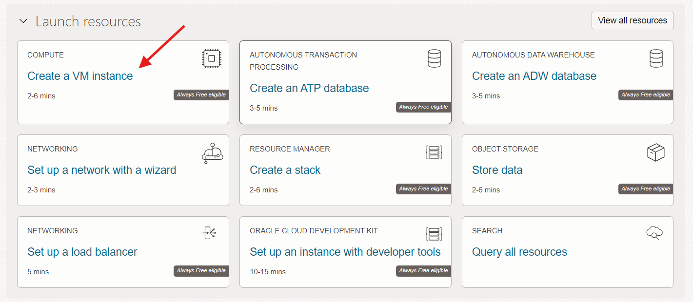

Please stay on *Always Free-eligible*. Choosing other options may compromise the instance's free state.

## Details of the instance

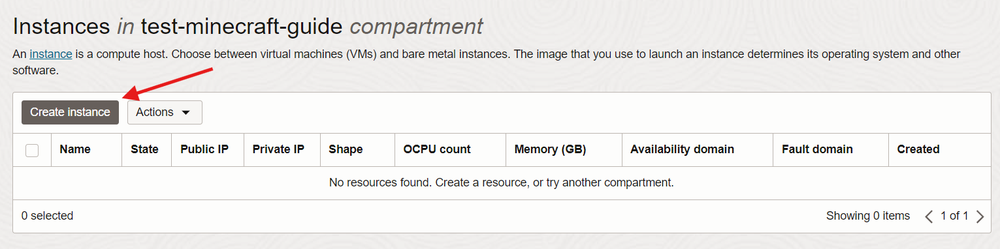  
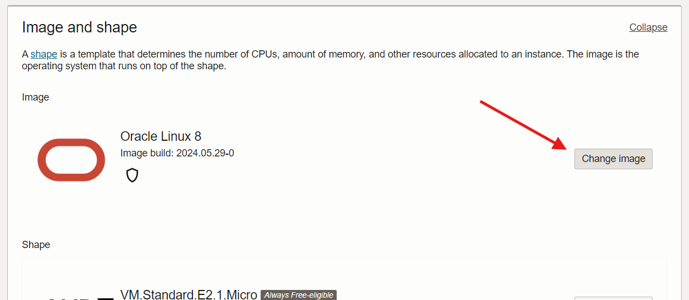  
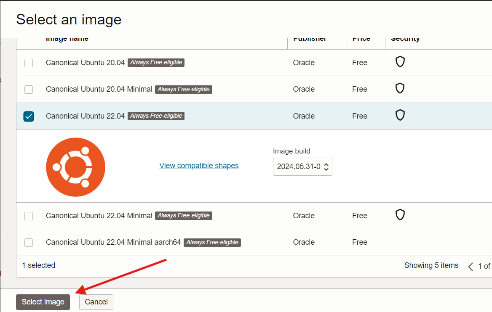
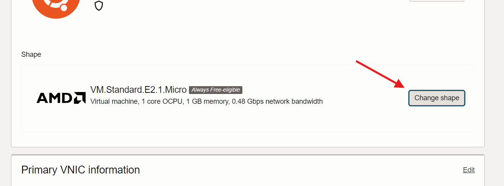  
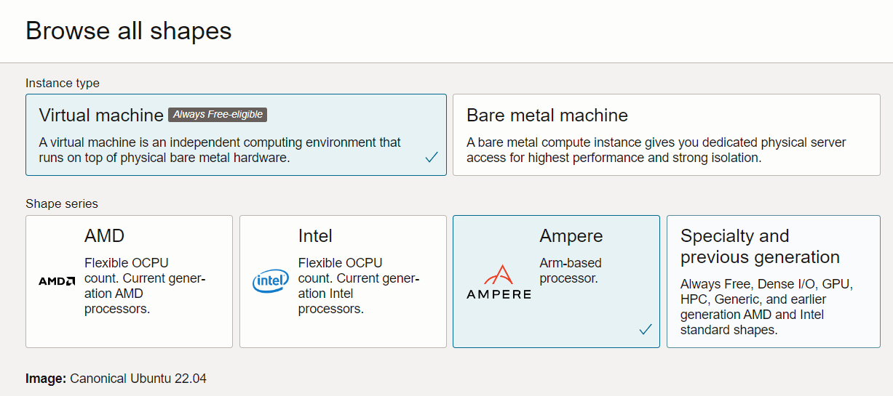

Select your wanted size. For this test build I used 1 CPU and 6GB of RAM, But I recommend at least 2 CPUs and 8GB of RAM for a vanilla 20 person server.

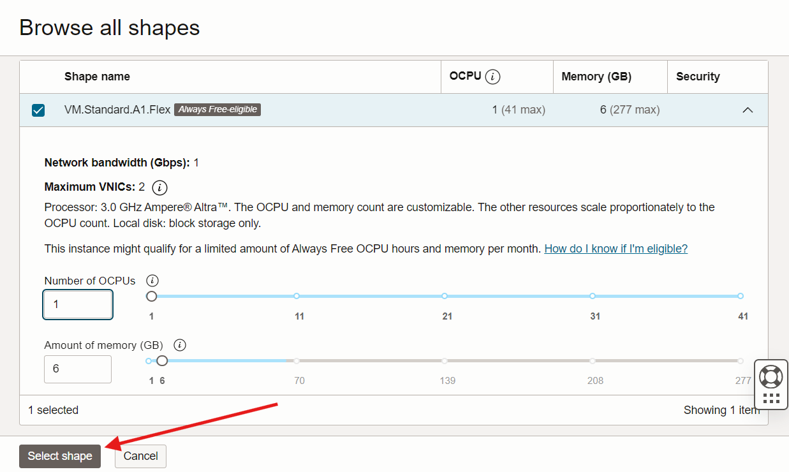

You can leave the VNIC configuration as default

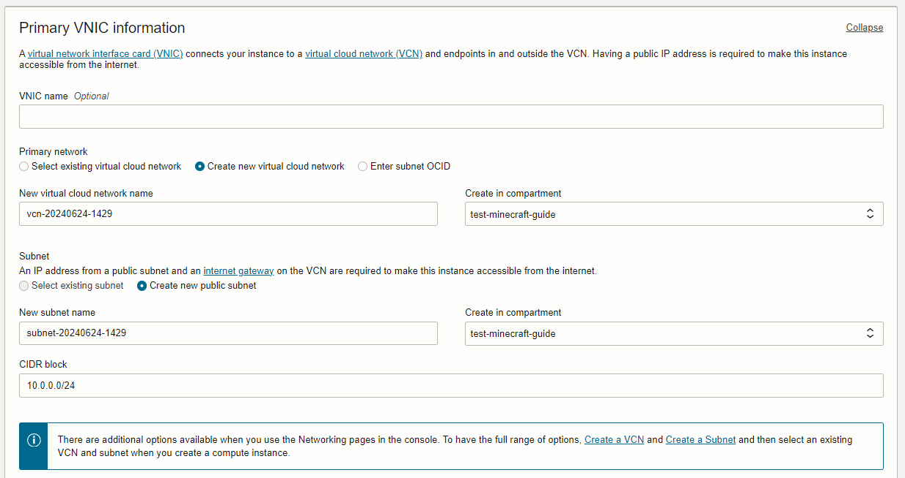
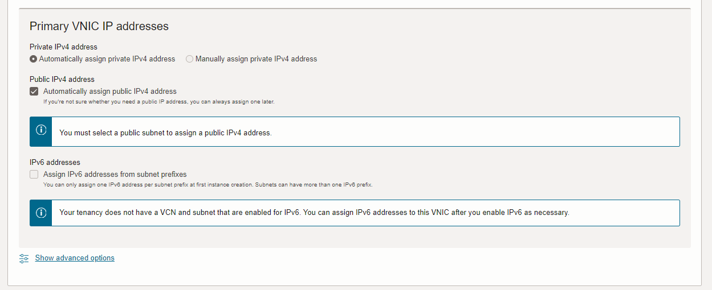


Make sure to download the private and public key. I recommend moving them to your .ssh file inside your OS. In windows It is usually stored in C:\\Users\\\<Your user\>\\.ssh 

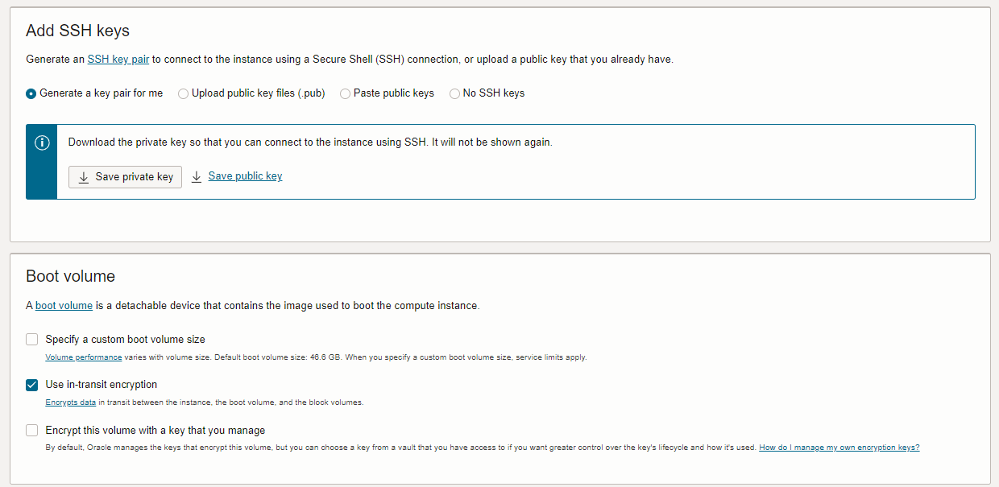
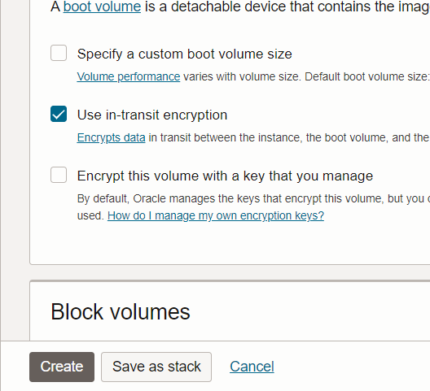
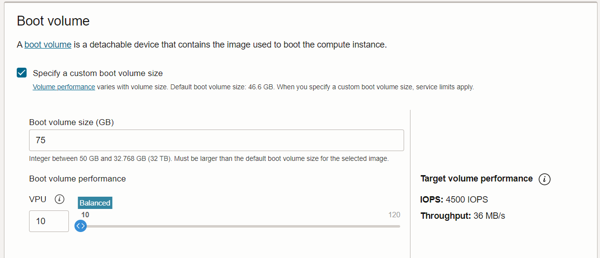

As soon as you click ‘Create’, you’ll be redirected to the VM details page and your VM instance will be in a PROVISIONING state.

After 30-60 seconds or so, the state will switch to RUNNING.  

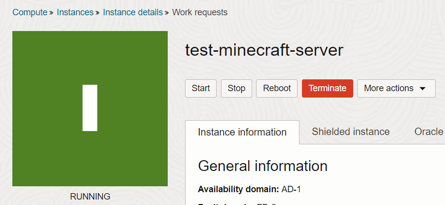

Find your public IP address and copy it.

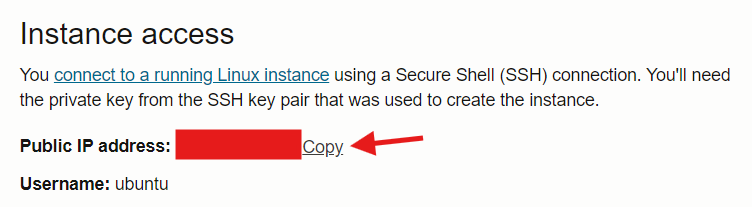


## Management

I recommend exploring these sections to further learn how to manage your instances.

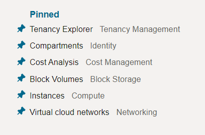

TIP: In case you were to edit your boot volume's speed and size refer to:

    "Block Storage > Boot Volumes > Boot Volume Details"


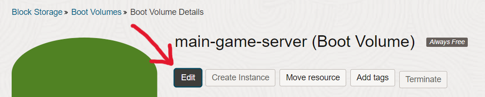

# Connecting to the instance

Using the downloaded keys. Connect to the running instance with these commands in Windows 11\. 

*Commands may vary when changing OS*

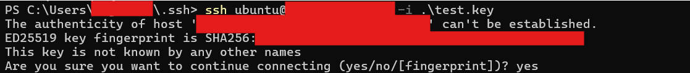

## Install OpenJDK

We need to install openjdk\_jre for running the server. Crafty installer includes this installation but it usually installs an old version which brings errors and reduces stability.  

```
 sudo apt update && sudo apt upgrade
```
```
 sudo apt install openjdk-21-jre-headless git
```

If there are any newer versions check for the same type of file. JRE stands for Java runtime environment. As we are only using java to run the server we will choose this option paired with headless (This is a server, only needed to connect through ssh). 

## Install Crafty

Consider following the crafty Linux install guide right [here](https://docs.craftycontrol.com/pages/getting-started/installation/linux/).  
I recommend installing the systemd service as well as the more stable version (master). 

```
 mkdir minecraft-server
```
```
 cd minecraft-server
```

```
 git clone https://gitlab.com/crafty-controller/crafty-installer-4.0.git
 cd crafty-installer-4.0
 sudo ./install_crafty.sh

```

Follow crafty installing steps

```
sudo systemctl enable crafty
```

```
 sudo systemctl start crafty
```

```
 sudo journalctl -u crafty.service -n 100
```

## Configure Crafty Ports

We need to configure the iptable rules and the instance subnet rules to allow crafty traffic: 

```
 sudo nano /etc/iptables/rules.v4
```


Make sure to add this lines (Uncomment port 8123 for Dynmap support):


```
-A INPUT -p tcp --dport 8000 -j ACCEPT
-A INPUT -p tcp --dport 8443 -j ACCEPT
#-A INPUT -p tcp --dport 8123 -j ACCEPT
-A INPUT -p tcp --match multiport --dports 25500:25600 -j ACCEPT
-A INPUT -p udp --match multiport --dports 25500:25600 -j ACCEPT
```

Apply the changes

```
sudo iptables-restore < /etc/iptables/rules.v4
```

Now for these ports to be reachable they need to be opened through our instance's security rules. Search for "Primary VNIC" in your instance details:

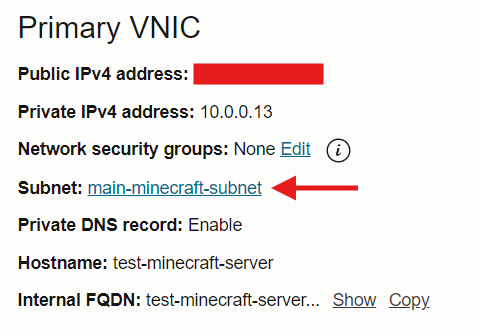
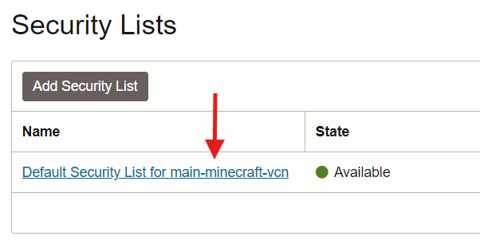
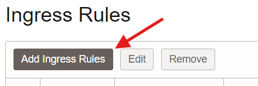

Make sure you add the following rules to your table: (Don’t delete any default rules, you might lock yourself out of the SSH connection\!) 

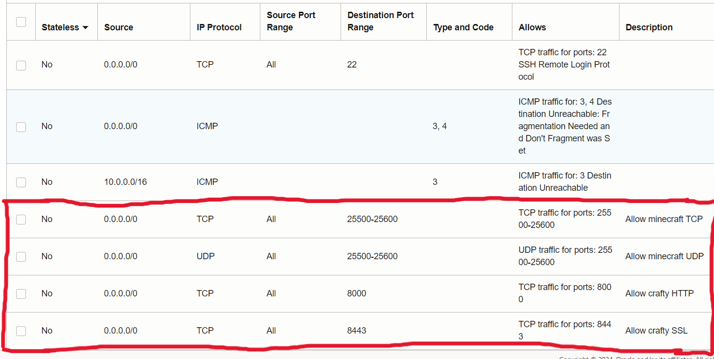

## Connecting to your Crafty

Now you should be able to enter your crafty page on your browser. Replace with your public IP (The same ip you used with SSH): https://\<Your Public IP\>:8443/   

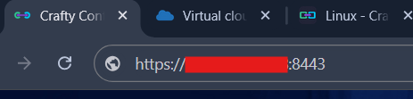

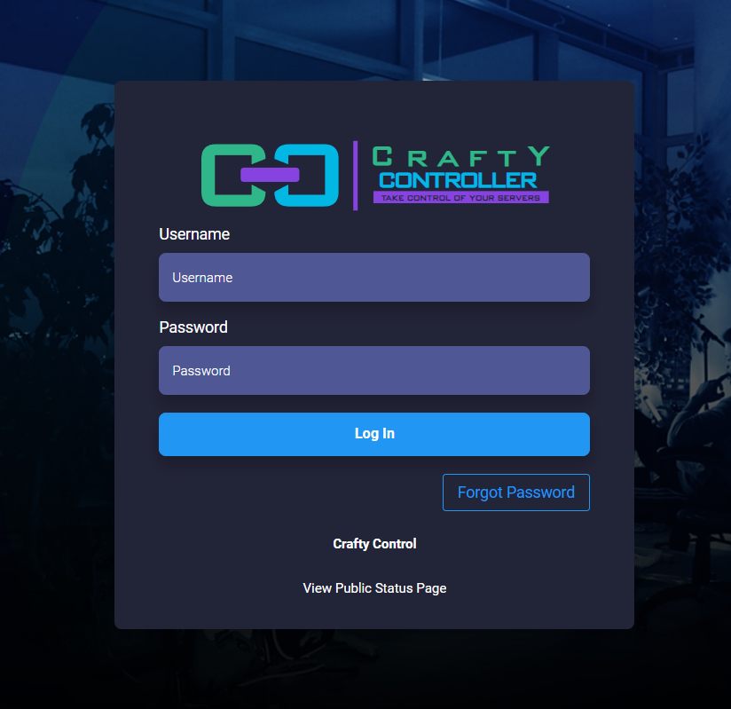

To access your default crafty credentials, execute this command in your server.

```
sudo cat /var/opt/minecraft/crafty/crafty-4/app/config/default-creds.txt
```
Copy and paste your user and password, log in and feel free to familiarize with your own minecraft server web manager\!

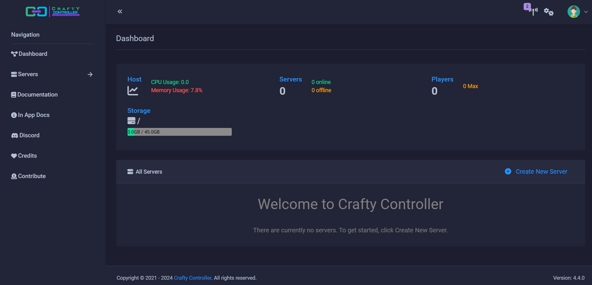
